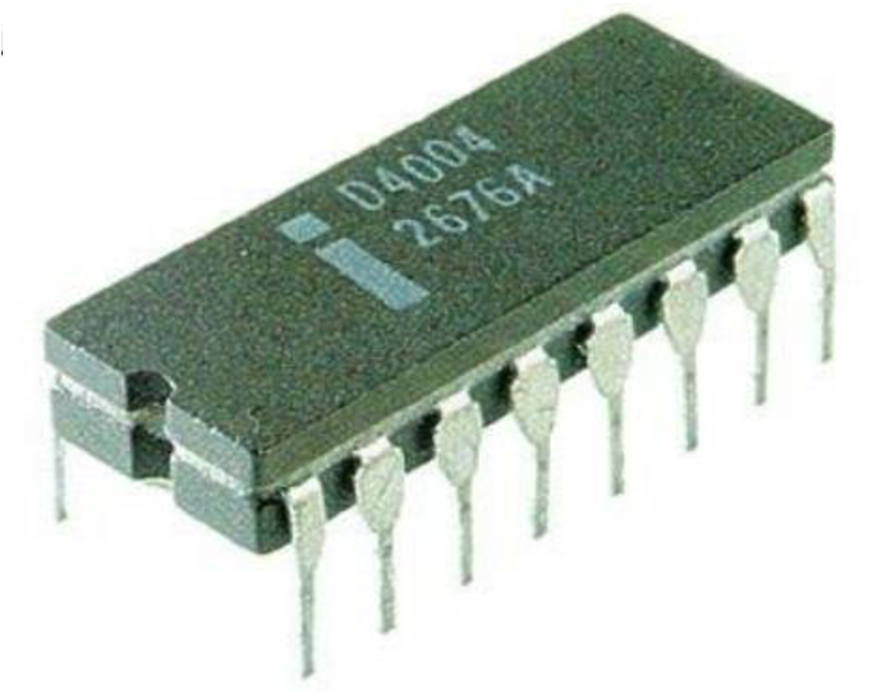

.. Pyntel4004-CLI documentation index file

Pyntel4004-CLI Documentation
============================

.. include:: global.rst

.. toctree::
   :maxdepth: 1

   Overview of the Intel 4004 <intelchipset>
   Command Line Interface <cli>

   
Virtual Chip (Pyntel4004)
Getting Started

   
Indices and tables
==================

* :ref:`genindex`
* :ref:`modindex`
* :ref:`search`
